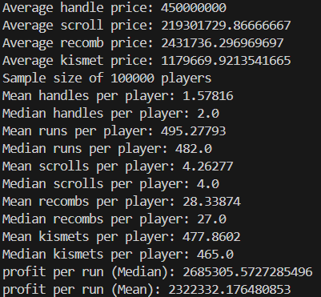

# F7 Profit calculator

**STRAT 1:** Setting rng meter to handle from start, without kismets

**STRAT 1:** Setting rng meter to handle from start, with kismets

> So kismets is worth on f7 even after handle prices tanked

**STRAT 2:** Only turning rng meter on when drop first handle without rng meter (with kismets)

**STRAT 3:** setting rng meter on until x runs without handle, then off til drop handle, then on for second handle (with kismets, x is 270 in this example)

**STRAT 4:** Setting rng meter on only after x runs, with kismets (x is 400 in this example)

> In conclusion, all these goofy strats look like they make about the same amount. So just stick to rng meter all the way, and **USE KISMETS**

