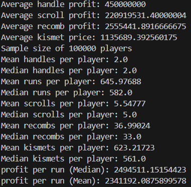

# Hypixel_Skyblock_Calcs
maybe this is a waste of time

# F7 Profit calculator

Setting rng meter to handle from start, without kismets

VS:
Setting rng meter to handle from start, with kismets

So kismets is worth on f7 even after handle prices tanked

Only turning rng meter on when drop first handle without rng meter (with kismets)

Slightly worse than just setting rng on handle from start

Setting rng meter on only when it is 80% filled

Setting rng meter on only when 100% filled

> In conclusion, all these goofy strats are goofy. just set rng meter on from the start, with kismets.

weird strat: setting rng meter on til 80% filled, then off til drop handle, then on for second handle 

Very close to just setting rng meter on from the start. But with kismets, by the time its 80% filled, we probably dropped the handle already, so ill try with switching it off after 270 runs

somehow its more money than just leaving it on handle from the start???? idk man u can try this strat but maybe my code is wrong somehow im gonna explode
both has the same profit per run if use mean values tho, idk what that means
