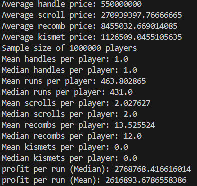

# Hypixel_Skyblock_Calcs
maybe this is a waste of time

# F7 Profit calculator

Setting rng meter to handle from start, without kismets

VS:
Setting rng meter to handle from start, with kismets

So kismets is worth on f7 even after handle prices tanked

Only turning rng meter on when drop first handle without rng meter (with kismets)

Slightly worse than just setting rng on handle from start

Setting rng meter on only when it is 80% filled

Setting rng meter on only when 100% filled

> In conclusion, all these goofy strats are goofy. just set rng meter on from the start, with kismets.

weird strat: setting rng meter on til 80% filled, then off til drop handle, then on for second handle 

with kismets, by the time its 80% filled, we probably dropped the handle already, so ill try with switching it off after 250 runs
